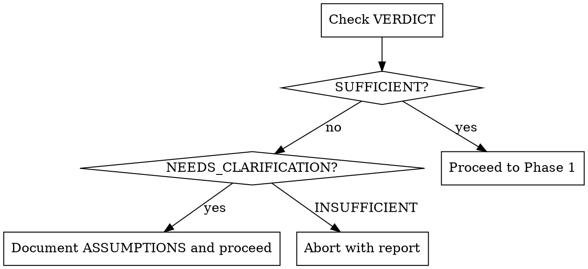

# Autopilot: Enterprise Task-to-PR Pipeline

Fully autonomous workflow. No questions. No human intervention. Pass anything — an issue, a ticket, a prompt — get a PR.

## Phase 0: TICKET ANALYSIS

Delegate to the `ticket-analyzer` skill to fetch, analyze, and assess the input before proceeding.

### 0.1 Run Ticket Analyzer

Invoke the `ticket-analyzer` skill with the raw `$ARGUMENTS`. The ticket-analyzer handles ALL of:
- Input type detection (GitHub, Jira, raw prompt)
- Data fetching (gh, acli jira)
- Attachment analysis (images, videos with frame extraction + whisper transcription)
- Codebase exploration (finding affected files, related logic, existing patterns)
- Language detection
- Sufficiency assessment

Store the full `TICKET_ANALYSIS` output.

### 0.2 Extract Key Fields

From the TICKET_ANALYSIS, extract and store:
- `SOURCE_TYPE` — github-issue, jira-ticket, or prompt
- `SOURCE_ID` — issue number, ticket ID, or slug
- `SOURCE_URL` — original URL if any
- `REPO_SLUG` — owner/repo (from ticket-analyzer or detect from `git remote get-url origin`)
- `TASK_DATA` — full ticket body + comments + media analysis + transcription + codebase context
- `TICKET_LANGUAGE` — detected language code
- `VERDICT` — SUFFICIENT, NEEDS_CLARIFICATION, or INSUFFICIENT

For GitHub issues, also store `ISSUE_NUMBER`. Use `--repo $REPO_SLUG` in all `gh` commands.

### 0.3 Gate



- **SUFFICIENT**: Proceed to Phase 1 with full TASK_DATA.
- **NEEDS_CLARIFICATION**: Store the assumptions from TICKET_ANALYSIS in `OPEN_ASSUMPTIONS`. Proceed to Phase 1 but include assumptions in the PR description.
- **INSUFFICIENT**: Abort the pipeline. Report what's missing. If source is a GitHub issue, post a comment listing the missing information.

## Phase 1: DISCOVERY (parallel, 3 agents)

### 1.1 Setup Workspace

Create isolated worktree via `EnterWorktree` with name derived from task: `autopilot-$SOURCE_ID`.

Where `SOURCE_ID` is:
- GitHub: the issue number (e.g., `251`)
- Jira: the ticket ID (e.g., `PROJ-456`)
- Prompt: a slug from the first few words (e.g., `add-dark-mode-toggle`)

### 1.2 Create Team

Use `TeamCreate` with name `autopilot-$SOURCE_ID`.

### 1.3 Spawn Discovery Agents (parallel)

Spawn 3 agents simultaneously using the Agent tool:

**Agent 1: issue-analyst**

```
Analyze this task and produce a structured classification.

TASK DATA:
{TASK_DATA}

MEDIA ANALYSIS (if available):
{MEDIA_ANALYSIS}

Send ISSUE_CLASSIFICATION via SendMessage to: product-owner, domain-expert
```

**Agent 2: product-owner**

```
Wait for ISSUE_CLASSIFICATION from issue-analyst, then produce REQUIREMENTS_DOC.

TASK DATA:
{TASK_DATA}

MEDIA ANALYSIS (if available):
{MEDIA_ANALYSIS}

Send REQUIREMENTS_DOC via SendMessage to: solutions-architect, ui-designer, api-designer, security-analyst
```

**Agent 3: domain-expert**

```
Wait for ISSUE_CLASSIFICATION from issue-analyst, then validate against business rules.

TASK DATA:
{TASK_DATA}

MEDIA ANALYSIS (if available):
{MEDIA_ANALYSIS}

Send DOMAIN_VALIDATION via SendMessage to: product-owner, solutions-architect
```

### 1.4 Gate

Wait for all 3 agents to complete. Collect:

- `ISSUE_CLASSIFICATION` from issue-analyst
- `REQUIREMENTS_DOC` from product-owner
- `DOMAIN_VALIDATION` from domain-expert

## Phase 2: BRAINSTORM (multi-round, agents answer each other's questions)

Applies the brainstorming skill principles autonomously — agents ask questions and other agents answer them, eliminating the need for human input.

### 2.1 Brainstorm Coordinator (orchestrator role)

The orchestrator acts as brainstorm facilitator. It:

1. Presents the REQUIREMENTS_DOC and ISSUE_CLASSIFICATION to all design agents
2. Each design agent generates clarifying questions about its domain
3. Questions are routed to the agent best positioned to answer:
   - Product/scope questions → product-owner answers
   - Business rule questions → domain-expert answers
   - Technical feasibility questions → solutions-architect answers
   - UI/UX questions → ui-designer answers
   - Security questions → security-analyst answers
   - Data model questions → database-architect answers

### 2.2 Brainstorm Rounds (max 3 rounds)

```
round = 0
while agents have unanswered questions and round < 3:
    collect BRAINSTORM_QUESTIONS from all active design agents
    route each question to the appropriate answering agent
    collect BRAINSTORM_ANSWERS
    distribute answers back to the questioning agents
    round += 1
```

### 2.3 Approach Proposals

After brainstorming, the solutions-architect proposes 2-3 implementation approaches with trade-offs. The devils-advocate challenges each approach. The orchestrator selects the recommended approach (or the one with strongest consensus among agents).

### 2.4 Gate

All agents have sufficient clarity to proceed. The brainstorm produces:

- Refined REQUIREMENTS_DOC (updated by PO based on brainstorm findings)
- APPROACH_DECISION (selected approach with rationale)
- OPEN_QUESTIONS (any remaining unknowns — documented for PR description)

## Phase 3: DESIGN (parallel, 2-5 agents based on classification)

### 3.1 Determine Active Agents

Use the classification to decide which design agents to spawn:

| Classification                                           | Agents to Spawn                                                      |
| -------------------------------------------------------- | -------------------------------------------------------------------- |
| `type: feature` + `areas: [frontend]`                    | solutions-architect, ui-designer, devils-advocate                    |
| `type: feature` + `areas: [backend]`                     | solutions-architect, api-designer, devils-advocate                   |
| `type: feature` + `areas: [frontend, backend]`           | solutions-architect, ui-designer, api-designer, devils-advocate      |
| `type: feature` + `areas: [database]`                    | solutions-architect, database-architect, devils-advocate             |
| `type: feature` + `areas: [frontend, backend, database]` | ALL design agents                                                    |
| `type: bug` + `areas: [frontend]`                        | solutions-architect, ui-designer, devils-advocate                    |
| `type: bug` (no frontend)                                | solutions-architect, devils-advocate                                 |
| `type: refactor` + `areas: [frontend]`                   | solutions-architect, ui-designer, devils-advocate                    |
| `type: refactor` (no frontend)                           | solutions-architect, devils-advocate                                 |
| `type: security`                                         | solutions-architect, security-analyst, devils-advocate               |
| `type: billing`                                          | solutions-architect, api-designer, security-analyst, devils-advocate |

### 3.2 Spawn Design Agents (parallel)

Pass each agent the collected Phase 1 outputs + brainstorm results:

```
REQUIREMENTS_DOC:
{refined requirements from brainstorm}

DOMAIN_VALIDATION:
{validation}

ISSUE_CLASSIFICATION:
{classification}

APPROACH_DECISION:
{selected approach from brainstorm}
```

**solutions-architect** → produces DESIGN_SPEC + TASK_LIST
**database-architect** → produces DB_DESIGN (if active)
**ui-designer** → produces UI_SPEC (if active)
**api-designer** → produces API_SPEC (if active)
**security-analyst** → produces SECURITY_CONSTRAINTS (if active)
**devils-advocate** → produces CHALLENGES + CONCERN_UNRESOLVED list

#### Frontend Design Injection for ui-designer

When spawning the ui-designer agent, the orchestrator MUST inject the `frontend-design` skill content into the agent's prompt. This ensures the designer produces creative, polished, professional designs — not generic AI slop.

Read the skill content from: `frontend-design:frontend-design` (invoke via Skill tool) or paste these principles:

```
FRONTEND DESIGN PRINCIPLES (from frontend-design skill):

Before designing, commit to a BOLD aesthetic direction:
- Purpose: What problem does this interface solve? Who uses it?
- Tone: Pick a clear direction that fits the project's brand
- Differentiation: What makes this UNFORGETTABLE?

Focus on:
- Typography: Bold choices in sizing, weight hierarchy, spacing
- Color: Dominant colors with sharp accents outperform timid, evenly-distributed palettes
- Motion: High-impact moments — staggered reveals, scroll-triggered animations, surprising hover states
- Spatial composition: Unexpected but intentional layouts. Asymmetry. Overlap. Generous negative space
- Backgrounds: Atmosphere and depth. Gradient meshes, layered transparencies, dramatic shadows
- NEVER generic: No plain bordered boxes, no cookie-cutter component patterns, no AI slop

Execute the vision with precision. Elegance comes from intentionality, not intensity.
```

Read the project's existing codebase to identify gold standard reference files that represent the project's visual quality bar.

### 3.3 Gate

Wait for all design agents. Collect all specs. The devils-advocate CONCERN_UNRESOLVED items are stored for the PR description.

Parse TASK_LIST from solutions-architect into individual tasks with dependencies.

## Phase 3.5: DESIGN EXPLORATION (sequential, 2 agents)

Visual design exploration using a rendered HTML playground and browser-based evaluation. An AI agent creates a design playground, then another AI agent opens it in a real browser, plays with all controls like a human designer, and extracts the winning design as a concrete implementation prompt.

### 3.5.0 Activation Check

Activate when ISSUE_CLASSIFICATION includes `areas` containing `frontend` — regardless of issue `type` (feature, bug, or refactor).
Skip entirely for backend-only, database-only, or non-frontend changes.
If skipped, frontend-developer receives UI_SPEC directly (existing behavior).

### 3.5.1 Spawn Design Playground Builder

**design-playground-builder** receives:

- UI_SPEC from ui-designer
- REQUIREMENTS_DOC from product-owner
- ISSUE_CLASSIFICATION from issue-analyst
- Instruction to write file to: `/tmp/design-playground-$ISSUE_NUMBER.html`

The agent:

1. Reads gold standard source files and theme.css
2. Creates a single HTML file following the playground skill pattern:
   - Controls panel on the left, live preview on the right, prompt output at the bottom with Copy button
   - 3-5 named presets + individual controls for fine-tuning
   - Preview renders the ACTUAL component/page from UI_SPEC with realistic sample data
   - Prompt output generates natural language implementation instructions
3. Writes file to `/tmp/design-playground-$ISSUE_NUMBER.html`
4. Sends `DESIGN_PLAYGROUND_READY` (with file path) to design-explorer

### 3.5.2 Spawn Design Explorer

**design-explorer** receives:

- `DESIGN_PLAYGROUND_READY` from design-playground-builder
- UI_SPEC from ui-designer (for context)

The agent:

1. Opens the HTML file in Playwright via `file://` URL
2. Surveys all presets — clicking each, taking screenshots, noting the best starting point
3. Systematically explores every control group:
   - Tries each dropdown option, keeps the best-looking one
   - Adjusts sliders to different positions, keeps optimal values
   - Toggles features on/off, keeps states that contribute to the design
4. Checks dark/light mode quality, adjusts controls if needed
5. Fine-tunes spacing for visual balance
6. Captures DESIGN_SCREENSHOTS at 4 viewports:
   - Desktop (1440x900) dark + light
   - Mobile (375x812) dark + light
   - Saves to `docs/qa/evidences/design-exploration-$ISSUE_NUMBER/`
7. Extracts the prompt output text from the playground
8. Sends `DESIGN_PROMPT` (the extracted prompt) to frontend-developer
9. Sends `DESIGN_SCREENSHOTS` (screenshot paths) to manual-qa-tester

### 3.5.3 Feedback Loop (max 1 revision)

```
if design-explorer finds playground broken (JS errors, blank preview, all options look poor):
    send DESIGN_PLAYGROUND_FEEDBACK to design-playground-builder
    design-playground-builder revises and sends DESIGN_PLAYGROUND_READY again
    design-explorer re-runs exploration workflow
```

### 3.5.4 Gate

Collect DESIGN_PROMPT from design-explorer.
If design exploration failed entirely (builder error, unrecoverable issues):
fallback: frontend-developer receives UI_SPEC + frontend-design skill principles (original behavior)
add note to PR description: "Design exploration failed, used text-based design guidance"

Clean up: `rm -f /tmp/design-playground-$ISSUE_NUMBER.html`

## Phase 4: IMPLEMENTATION (parallel where independent, 1-4 agents)

### 4.1 Determine Active Implementers

| Classification | Implementers                                                                        |
| -------------- | ----------------------------------------------------------------------------------- |
| Frontend only  | frontend-developer                                                                  |
| Backend only   | backend-developer                                                                   |
| Database only  | database-developer                                                                  |
| Full-stack     | database-developer → backend-developer + frontend-developer → integration-developer |
| API only       | backend-developer, integration-developer                                            |

Database tasks run FIRST (other implementers depend on migrations).
Frontend and backend run in PARALLEL after database.
Integration runs LAST (depends on frontend + backend).

### 4.2 Spawn Implementers

Pass each implementer the relevant specs:

**database-developer** receives: DB_DESIGN
**backend-developer** receives: DESIGN_SPEC, API_SPEC, SECURITY_CONSTRAINTS
**frontend-developer** receives: DESIGN_SPEC, UI_SPEC, DESIGN_PROMPT (from design-explorer, if available), SECURITY_CONSTRAINTS
**integration-developer** receives: DESIGN_SPEC (spawned after frontend + backend complete)

When DESIGN_PROMPT is available (Phase 3.5 ran), pass it as the primary visual guide — it contains specific Tailwind classes, design decisions, and implementation instructions that were visually validated in a rendered playground. When DESIGN_PROMPT is NOT available (Phase 3.5 skipped), inject the frontend-design skill principles instead.

### 4.3 Gate

Wait for all implementers to complete. Each sends TASK_COMPLETE when done.

## Phase 5: TESTING (parallel, 2-4 agents)

### 5.1 Determine Active Test Writers

| Classification | Test Writers                                                                     |
| -------------- | -------------------------------------------------------------------------------- |
| Frontend only  | unit-test-writer, accessibility-tester                                           |
| Backend only   | integration-test-writer                                                          |
| Full-stack     | unit-test-writer, integration-test-writer, e2e-test-writer, accessibility-tester |
| API only       | integration-test-writer                                                          |
| Has UI         | + accessibility-tester                                                           |

### 5.2 Spawn Test Writers (parallel)

Pass each the list of modified files and the relevant specs.

### 5.3 Feedback Loop (max 3 iterations)

```
iteration = 0
while any test writer reports TEST_FAILURE and iteration < 3:
    collect all TEST_FAILURE messages
    group failures by responsible implementer
    re-spawn relevant implementer(s) with failure details
    wait for implementer fixes
    re-spawn failing test writer(s)
    iteration += 1

if iteration == 3 and still failing:
    store failures for PR description
    add label "tests-need-attention"
```

### 5.4 Gate

All test writers report TEST_PASS, or circuit breaker triggered.

## Phase 6: MANUAL QA (1 agent, browser-based)

Real browser testing via Playwright MCP tools. Verifies the feature works end-to-end as a real user would experience it — not just passing tests, but actually functional in the browser.

### 6.1 Service Startup & Port Management

Before spawning the QA agent, the orchestrator MUST ensure all required development services are running. Multiple autopilot instances may run in parallel, so ports may be occupied.

Start the project's development servers as documented in its README or CLAUDE.md. Check for required services (web app, API, payment webhooks) and start them with appropriate port management.

**Port Management:**

Check if default ports are occupied, and if so, shift to alternative ports. Store the assigned ports for the QA agent.

```
lsof -i :<default-port> -t
```

For each required service, if the default port is occupied, increment to find the next available port. Ensure all services for this autopilot instance use a consistent port set to avoid cross-contamination between parallel runs.

Wait for all services to be ready by polling their health endpoints. Store the base URL for the QA agent as `QA_BASE_URL`.

### 6.2 Spawn Manual QA Tester

Activated when the issue has ANY user-facing changes (frontend, API responses visible to users, billing flows).
Skipped ONLY for pure refactoring, infrastructure, or CI-only changes.

**manual-qa-tester** receives:

- QA_BASE_URL (the actual URL to test against — may differ from defaults if ports were shifted)
- REQUIREMENTS_DOC from product-owner (acceptance criteria to verify in browser)
- UI_SPEC from ui-designer (expected visual behavior)
- DESIGN_SCREENSHOTS paths (from design-explorer, if available) — for design fidelity comparison
- List of all modified files
- ISSUE_CLASSIFICATION (to understand what areas to test)

The agent:

1. Navigates to the app at `$QA_BASE_URL`
2. Generates 3-8 test scenarios from the acceptance criteria
3. Executes each scenario using Playwright MCP browser tools
4. Runs cross-cutting checks after every action (console errors, network failures, state persistence)
5. Captures screenshot evidence to `docs/qa/evidences/`
6. If DESIGN_SCREENSHOTS exist, performs DESIGN FIDELITY CHECK:
   - Reads the reference screenshots from `docs/qa/evidences/design-exploration-$ISSUE_NUMBER/`
   - Takes matching screenshots of the implemented feature at the same viewports (desktop dark/light, mobile dark/light)
   - Compares implementation against the design reference: color accuracy, spacing/layout, typography, component styling, dark/light mode quality
   - Reports design deviations as `QA_FAILURE` with type `design-fidelity` — includes specific differences and reference screenshot paths
7. Produces a QA_REPORT with PASS/FAIL per scenario and bug list

### 6.3 Feedback Loop (max 3 iterations)

```
iteration = 0
while manual-qa-tester reports QA_FAILURE and iteration < 3:
    collect QA_FAILURE messages with bug details
    group bugs by responsible implementer (frontend/backend/integration)
    re-spawn relevant implementer(s) with:
      - specific bug description
      - screenshot evidence path
      - console errors and network failures
      - expected vs actual behavior
    wait for implementer fixes
    re-spawn manual-qa-tester for re-test of failed scenarios only
    iteration += 1

if iteration == 3 and still failing:
    store QA_REPORT for PR description
    add label "qa-attention-needed"
```

### 6.4 Gate

manual-qa-tester reports QA_APPROVED, or circuit breaker triggered.

### 6.5 QA Report Artifact

Save the full QA report to `docs/qa/{date}-autopilot-{issue-number}.md` for the project record.

### 6.6 Service Cleanup

After QA completes (pass or fail), kill the services started in 6.1 using the stored port numbers.

## Phase 7: REVIEW (parallel, 3 agents)

### 7.1 Spawn All Review Agents (parallel)

Always spawn all 3:

**spec-compliance-verifier** receives: REQUIREMENTS_DOC + list of all modified files
**code-quality-reviewer** receives: list of all modified files
**convention-enforcer** receives: instruction to read the project's CLAUDE.md and run the project's verification command (e.g., `npm run verify`, `make check`, etc.). If no verification command is documented, run the project's linter and test suite.

### 7.2 Feedback Loop (max 3 iterations)

```
iteration = 0
while any reviewer reports issues and iteration < 3:
    collect SPEC_VIOLATION, QUALITY_ISSUES, VERIFY_FAILURE
    group by responsible implementer
    re-spawn relevant implementer(s) with specific fixes needed
    wait for fixes
    re-spawn failing reviewer(s)
    iteration += 1

if iteration == 3 and still failing:
    store issues for PR description
    add label "review-attention-needed"
```

### 7.3 Gate

All reviewers approve, or circuit breaker triggered.

## Phase 8: SHIP

### 8.1 Commit All Changes

Stage all modified files (explicit paths, not `git add -A`).

Commit with message format:

```
feat: <short description from PO requirements> #$SOURCE_ID
```

Use appropriate prefix: `feat:`, `fix:`, `refactor:`, `docs:` based on issue classification.

### 8.2 Push Branch

```
git push -u origin claude/autopilot-$SOURCE_ID
```

### 8.3 Create PR

Use `gh pr create` with this template:

```
gh pr create --repo $REPO_SLUG --title "<type>: <short description> #$SOURCE_ID" --body "$(cat <<'EOF'
## Summary
{product-owner's requirements summary}

## Source
{source_type}: {source_url or source_id}
{If assumptions were made due to sparse input, list them under "Assumptions"}

## Acceptance Criteria
{spec-compliance-verifier's checklist with ✅/❌ per criterion}

## Technical Changes
{solutions-architect's technical description}

## Security Considerations
{security-analyst's findings, or "N/A"}

## Unresolved Concerns
{devils-advocate's CONCERN_UNRESOLVED items, or "None"}

## Test Coverage
- Unit tests: {count} added/modified
- Integration tests: {count} added/modified
- E2E tests: {count} added/modified
- Accessibility: {pass/fail with details}

## Manual QA Results
{manual-qa-tester's QA_REPORT summary: scenarios passed/failed, bugs found}
{Link to full QA report: docs/qa/{date}-autopilot-{source_id}.md}

## Verify Output
{convention-enforcer's verification result: PASS or summary of issues}

{labels_note}

{If source_type is github-issue: "Closes #$ISSUE_NUMBER"}
{If source_type is jira-ticket: "Jira: $TICKET_ID"}
EOF
)"
```

Note: If `REPO_SLUG` is not available (e.g., raw prompt input without a GitHub remote), detect it from `git remote get-url origin` before creating the PR.

### 8.4 Add Labels

Copy labels from the original issue/ticket (if available). Add extra labels based on pipeline result:

- `autopilot` (always)
- `tests-need-attention` (if automated test circuit breaker triggered)
- `qa-attention-needed` (if manual QA circuit breaker triggered)
- `review-attention-needed` (if review circuit breaker triggered)

### 8.5 Cleanup

Use `TeamDelete` to clean up the team.
Report PR URL to user.

## Error Recovery

| Error                     | Recovery                                               |
| ------------------------- | ------------------------------------------------------ |
| Input cannot be resolved  | Abort with clear error message explaining what was received and what's expected |
| `gh issue view` fails     | Abort with clear error message                         |
| `acli jira` fails         | Try WebFetch on URL, then abort if still fails         |
| Attachment download fails  | Skip attachment, note in MEDIA_ANALYSIS, proceed       |
| ffmpeg not available       | Skip video frame extraction, note limitation, proceed  |
| Sufficiency check fails   | Abort with report of what's missing                    |
| Agent spawn fails         | Retry once, then orchestrator handles that role inline |
| Worktree creation fails   | Abort with clear error message                         |
| All implementers fail     | Abort, delete worktree, report what was learned        |
| Verification fails 2x    | Create PR anyway with failures documented              |
| `gh pr create` fails      | Push branch, report URL for manual PR creation         |

## Model Cost Strategy

| Agent                     | Model  | Rationale                               |
| ------------------------- | ------ | --------------------------------------- |
| input-resolver            | sonnet | Mechanical input parsing                |
| media-analyzer            | opus   | Visual comprehension of attachments     |
| issue-analyst             | sonnet | Mechanical classification               |
| product-owner             | opus   | Product reasoning                       |
| domain-expert             | opus   | Business logic reasoning                |
| solutions-architect       | opus   | Architecture decisions                  |
| database-architect        | opus   | Schema design                           |
| ui-designer               | opus   | Design decisions                        |
| api-designer              | opus   | API contract design                     |
| security-analyst          | opus   | Security reasoning                      |
| devils-advocate           | opus   | Critical thinking                       |
| frontend-developer        | opus   | Complex implementation                  |
| backend-developer         | opus   | Complex implementation                  |
| database-developer        | sonnet | Mechanical migration writing            |
| integration-developer     | sonnet | Mechanical wiring                       |
| unit-test-writer          | sonnet | Pattern-based test writing              |
| integration-test-writer   | sonnet | Pattern-based test writing              |
| e2e-test-writer           | opus   | Complex test scenarios                  |
| accessibility-tester      | sonnet | Checklist verification                  |
| spec-compliance-verifier  | opus   | Reasoning about coverage                |
| code-quality-reviewer     | opus   | Quality judgment                        |
| manual-qa-tester          | opus   | Complex browser interaction & judgment  |
| design-playground-builder | opus   | Creative HTML playground generation     |
| design-explorer           | opus   | Visual judgment via browser interaction |
| convention-enforcer       | sonnet | Mechanical verification                 |
