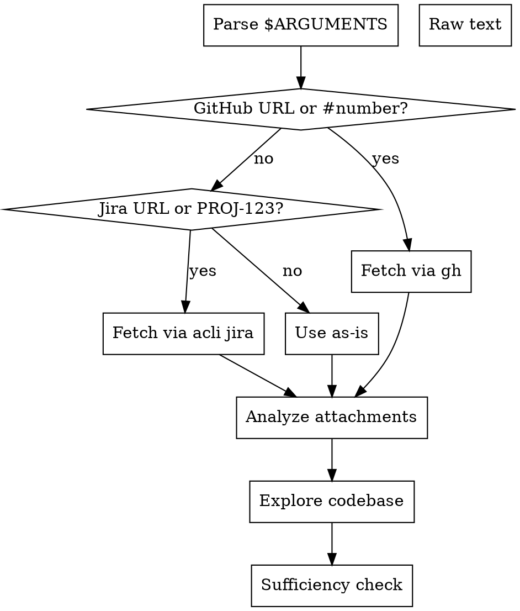

# Ticket Analyzer

Analyzes any ticket, issue, or task description — fetches data, analyzes attachments (including video transcription), explores the codebase for context, and determines whether there is enough information to begin implementation. Responds in the same language as the ticket.

## Parse Input

Determine the input type from `$ARGUMENTS`:



| Pattern | Type | Action |
|---------|------|--------|
| `https://github.com/.*/issues/\d+` | `github-issue` | Extract owner, repo, issue number |
| `#?\d+` (bare number only) | `github-issue` | Detect repo from `git remote get-url origin` |
| `https://.*atlassian.net/browse/[A-Z]+-\d+` | `jira-ticket` | Extract ticket ID |
| `https://.*jira.*/browse/[A-Z]+-\d+` | `jira-ticket` | Extract ticket ID |
| `[A-Z]{2,}-\d+` (standalone) | `jira-ticket` | Use as ticket ID |
| Everything else | `prompt` | Use full text as task description |

If the input contains a URL inside a longer text, extract the URL as source AND the surrounding text as additional context.

### GitHub Issues

Extract issue number from URL (`https://github.com/owner/repo/issues/123`) or bare number (`123`, `#123`).

Detect `OWNER/REPO` from the URL or from `git remote get-url origin`.

Fetch: `gh issue view <number> --repo <OWNER/REPO> --json title,body,labels,milestone,assignees,comments`

Store as `TASK_DATA` with fields: `source_type`, `source_id`, `title`, `body`, `labels`, `attachments[]`.

For GitHub issues, also store `ISSUE_NUMBER` and `REPO_SLUG`.

### Jira Tickets

Extract ticket ID from URL (`https://company.atlassian.net/browse/PROJ-456`) or bare ID (`PROJ-456`).

Fetch: `acli jira workitem view <TICKET-ID>`

Also fetch full JSON for attachments: `acli jira workitem view <TICKET-ID> --fields "*all" --json`

### Raw Descriptions

Use `$ARGUMENTS` directly as the ticket body.

## Detect Language

Detect the primary language of the ticket body. All analysis output and the final report MUST be written in this language. If the ticket is in Polish, respond in Polish. If German, respond in German. Default to English only if language is undetectable.

## Analyze Attachments

Scan the ticket body and comments for attachments (images, videos, documents, screen recordings).

### Authentication for Jira Attachments

Jira Cloud attachments require OAuth. To download:
1. Read cloud_id and account_id from `~/.config/acli/global_auth_config.yaml`
2. Extract token: `security find-generic-password -s "acli" -a "oauth:<cloud_id>:<account_id>" -w` → strip `go-keyring-base64:` → base64 decode → gunzip → parse JSON `access_token`
3. Download via: `curl -sL -H "Authorization: Bearer $TOKEN" "https://api.atlassian.com/ex/jira/<cloud_id>/rest/api/3/attachment/content/<id>"`

GitHub attachments can typically be downloaded directly without auth.

### Images
- Download and view each image using the Read tool
- Describe what the image shows (UI state, errors, mockups, diagrams)

### Videos (.mp4, .mov, .webm, Loom links)

1. Ensure temp directory exists:
```
mkdir -p .tmp
```

2. Download the video:
```
curl -sL -o .tmp/ticket-analysis-video.<ext> "<url>"
```

3. Get duration:
```
ffprobe -v quiet -print_format json -show_format ".tmp/ticket-analysis-video.<ext>"
```

4. Extract frames every 5 seconds:
```
ffmpeg -i ".tmp/ticket-analysis-video.<ext>" -vf "fps=1/5" -q:v 2 ".tmp/ticket-frames/frame_%04d.jpg"
```

5. Burn timestamps into frames for reference:
```
magick <frame>.jpg -font /System/Library/Fonts/Helvetica.ttc -gravity NorthWest -pointsize 36 -fill white -undercolor '#000000CC' -annotate +10+10 " <HH:MM:SS> " <frame>_ts.jpg
```

6. Read each frame with the Read tool to build a visual timeline of what the video shows.

7. Extract subtitles if present:
```
ffmpeg -i ".tmp/ticket-analysis-video.<ext>" -map 0:s:0 ".tmp/ticket-subtitles.srt" 2>/dev/null
```

8. Transcribe audio narration using whisper-cpp (local, free, no API key).

First check if whisper-cli and the model are available:
```
which whisper-cli
ls ~/.local/share/whisper-models/ggml-large-v3.bin
```

If whisper-cli is NOT installed, install it:
```
brew install whisper-cpp
```

Model selection — always prefer the largest model the machine can handle:

**Primary: large-v3 (~3.1GB, best accuracy)**
```
mkdir -p ~/.local/share/whisper-models
curl -L -o ~/.local/share/whisper-models/ggml-large-v3.bin "https://huggingface.co/ggerganov/whisper.cpp/resolve/main/ggml-large-v3.bin"
```

**Fallback: medium (~1.5GB, if machine has <8GB available RAM)**
```
curl -L -o ~/.local/share/whisper-models/ggml-medium.bin "https://huggingface.co/ggerganov/whisper.cpp/resolve/main/ggml-medium.bin"
```

Never use the small model — accuracy is insufficient for non-English content.

Check available memory to choose: `sysctl hw.memsize | awk '{print $2/1024/1024/1024 " GB"}'`
Use large-v3 if >= 16GB RAM, fall back to medium otherwise.

Then transcribe:
```
ffmpeg -i ".tmp/ticket-analysis-video.<ext>" -ar 16000 -ac 1 -c:a pcm_s16le ".tmp/ticket-analysis-audio.wav"
whisper-cli -m ~/.local/share/whisper-models/ggml-large-v3.bin -f ".tmp/ticket-analysis-audio.wav" -osrt -l auto
```

If large-v3 fails (out of memory), retry with medium model.

Auto-detects language. Narration often contains critical context missing from ticket text (root cause, expected behavior, reproduction steps). Treat transcription with equal weight to the written ticket body.

9. Clean up downloaded media after analysis.

### Documents (.pdf, .doc)
- Download and read using the Read tool

### Loom / Screen Recordings
- Fetch the page via WebFetch to get metadata and any direct video URL
- If video URL found, process as a regular video

## Explore Codebase

After gathering all ticket context (text + attachments + transcription), explore the project codebase to understand what the ticket is referring to.

### Discovery Strategy

1. Read `README.md`, `CLAUDE.md`, and `docs/` to understand the project domain, tech stack, and architecture.

2. Based on keywords, component names, URLs, or feature names mentioned in the ticket (or visible in screenshots/video):
   - Search for related files: components, routes, services, data models
   - Search for related functions, API endpoints, or UI elements
   - Search for error messages or UI text strings seen in screenshots

3. If the ticket references a URL path (e.g., `/requests/trip/...`), find the route handler and the components that render it.

4. If the ticket references user roles or permissions (e.g., "manager", "employee"), find how roles are defined and enforced in the codebase.

5. Identify:
   - **Affected files** — which files would likely need changes
   - **Related logic** — business rules, state machines, data flows relevant to the ticket
   - **Existing patterns** — how similar features are currently implemented

### Codebase Context Output

Produce a `CODEBASE_CONTEXT` section:

```
## Codebase Context
- Affected area: <component/module/service name>
- Key files:
  - <file:line> — <what it does relevant to the ticket>
  ...
- Related logic:
  - <description of relevant business rule or data flow>
  ...
- Existing patterns:
  - <how similar things are handled in the codebase>
  ...
```

This exploration helps the sufficiency analysis — if the codebase reveals that the ticket's request is straightforward (e.g., changing a visibility flag), a sparse ticket may still be SUFFICIENT. Conversely, if the codebase shows complex state management, more specification may be needed.

## Sufficiency Analysis

Evaluate the ticket against these criteria, considering text + attachments + transcription + codebase context:

### Required Information (must have ALL for "sufficient"):

1. **Clear objective** — What should be achieved? Is there a definitive goal?
2. **Acceptance criteria** — How do we know when it's done? (explicit or clearly inferable from text, attachments, or codebase)
3. **Reproduction steps** (bugs only) — Can a developer reproduce the issue?
4. **Scope clarity** — Is it clear what's in scope and what's not?

### Valuable Information (strengthens the ticket):

5. **Visual reference** — Screenshots, mockups, or video showing expected/current behavior
6. **Technical context** — Affected components, endpoints, data models mentioned
7. **Edge cases** — Non-obvious scenarios addressed
8. **Priority/severity** — How urgent and impactful is this?
9. **User impact** — Who is affected and how?
10. **Environment details** (bugs only) — Browser, OS, account type, etc.

### Assessment from Attachments:

Consider what the attachments reveal. A video showing a bug reproduction may satisfy both "reproduction steps" and "visual reference" even if the text description is sparse.

### Assessment from Codebase:

Consider what the codebase reveals. If you can identify the exact code that needs to change and the change is straightforward, a sparse ticket may still be sufficient. If the affected area is complex with many edge cases, more specification is needed.

## Output: TICKET_ANALYSIS

Respond in the detected ticket language. Structure:

```
TICKET_ANALYSIS
source_type: <github-issue|jira-ticket|prompt>
source_id: <issue number, ticket ID, or "prompt">
source_url: <original URL if any>
repo_slug: <OWNER/REPO if detectable>
title: <ticket title>
language: <detected language code>
verdict: <SUFFICIENT|NEEDS_CLARIFICATION|INSUFFICIENT>
confidence: <HIGH|MEDIUM|LOW>

## Task Data
<full ticket body + comments>

## Media Analysis
<attachment descriptions, video timeline, transcription>

## Codebase Context
<affected files, related logic, existing patterns>

## What's Clear
- <item that IS well-defined>
...

## What's Missing
- <item that is MISSING or UNCLEAR, with explanation of why it matters>
...

## What Attachments Reveal
- <key context extracted from images/videos/transcription>
...

## What Codebase Reveals
- <relevant findings from code exploration>
...

## Recommendations
- <specific suggestion for what to add to the ticket>
...

## Assumptions (if verdict is NEEDS_CLARIFICATION)
- <assumption that would be made if proceeding without clarification>
...
```

### Verdict Rules

- **SUFFICIENT**: All 4 required criteria met (from text + attachments + codebase combined). Ready for implementation.
- **NEEDS_CLARIFICATION**: 2-3 required criteria met. Could start with documented assumptions but risks exist. List what to clarify.
- **INSUFFICIENT**: 0-1 required criteria met. Should not start implementation. List what's needed.

## Cleanup

Remove any downloaded media files after analysis:
```
rm -rf .tmp/ticket-analysis-video.* .tmp/ticket-frames/ .tmp/ticket-subtitles.srt .tmp/ticket-analysis-audio.wav
```
